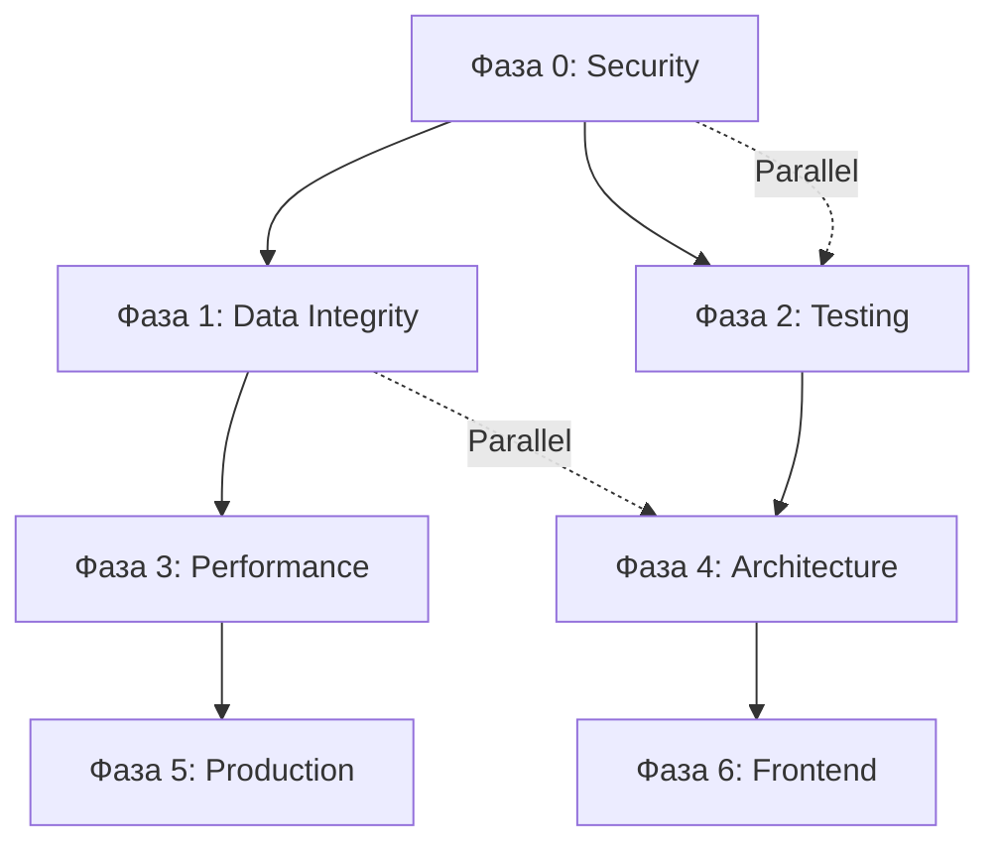

# Roadmap до StockFlow v1.0

**Дата:** 30 июля 2026  
**Текущий статус:** Pre-Alpha (7.0/10)

---

## Фаза 0: Критические исправления (1-2 дня)

**Цель:** Устранить блокеры безопасности

### Спринт 0.1 — Security Emergency (1 день)
- [ ] Отозвать production credentials (DB, Redis)
- [ ] Сгенерировать новый JWT_SECRET (openssl rand -base64 64)
- [ ] Добавить .env в .gitignore
- [ ] Удалить .env из git истории
- [ ] Настроить Railway secrets manager

### Спринт 0.2 — Security Hardening (1 день)
- [ ] Разделить secrets для access и refresh токенов
- [ ] Использовать bcrypt rounds из конфига (не hardcoded)
- [ ] Добавить rate limit на /auth/login (5 req/min)
- [ ] Удалить companyId из DTO (меж-tenant vector)
- [ ] Заменить хардкод UUID в AuditLog

---

## Фаза 1: Стабильность данных (1 неделя)

**Цель:** Гарантия целостности данных

### Спринт 1.1 — Outbox Pattern (3 дня)
- [ ] Создать таблицу `outbox_events` в Prisma
- [ ] Реализовать `OutboxEventBus` (запись в БД)
- [ ] Background worker для отправки событий
- [ ] Retry механизм с exponential backoff
- [ ] Idempotency keys для обработчиков

### Спринт 1.2 — Data Integrity (2 дня)
- [ ] Проверить и добавить недостающие индексы
  - `FinancialTransaction(companyId, referenceType, referenceId)`
  - `AuditLog(companyId, createdAt)`
  - `StockMovement(companyId, productId, createdAt)`
- [ ] Добавить миграции с индексами
- [ ] Проверить все foreign keys

---

## Фаза 2: Тестирование (2 недели)

**Цель:** Покрытие критических модулей тестами

### Спринт 2.1 — Unit Tests (5 дней)
- [ ] Sales модуль: create, complete, refund, status transitions
- [ ] Finance модуль: journal entries, account balances
- [ ] Purchasing модуль: purchase orders, goods receipt
- [ ] Auth модуль: login, register, refresh, lockout
- [ ] Customers модуль: CRUD, soft delete, company isolation

### Спринт 2.2 — Integration Tests (3 дня)
- [ ] Prisma queries с реальной БД
- [ ] Company isolation tests
- [ ] Transaction rollback tests
- [ ] Optimistic locking tests

### Спринт 2.3 — E2E Tests (5 дней)
- [ ] Auth flow: Register → Login → Refresh → Logout
- [ ] Sales flow: Create Customer → Create Product → Create Sale → Complete Sale
- [ ] Inventory flow: Purchase → Receive → Sell → Check Stock
- [ ] Finance flow: Sale → Journal Entry → Account Balance
- [ ] Billing flow: Subscribe → Invoice → Payment

### Спринт 2.4 — Load Tests (2 дня)
- [ ] Внедрить k6 тесты в CI
- [ ] Нагрузочное тестирование: 100, 500, 1000 concurrent users
- [ ] Staging окружение для нагрузочного тестирования

---

## Фаза 3: Производительность (1 неделя)

**Цель:** Оптимизация скорости ответа

### Спринт 3.1 — Кэширование (3 дня)
- [ ] Кэшировать permissions в Redis (TTL 5 min)
- [ ] Кэшировать списки products/customers (TTL 1 min)
- [ ] Кэшировать chart of accounts (TTL 5 min)
- [ ] Инвалидация кэша при изменениях

### Спринт 3.2 — Query Optimization (2 дня)
- [ ] Исправить N+1 в CustomersRepository.findAll
- [ ] Внедрить DataLoader pattern для batch queries
- [ ] Оптимизировать pagination (cursor-based для больших таблиц)
- [ ] Connection pool tuning для PostgreSQL

### Спринт 3.3 — Batch Operations (2 дня)
- [ ] Bulk create/update endpoints
- [ ] CSV/Excel import для Products, Customers
- [ ] Async processing для больших операций

---

## Фаза 4: Архитектурный рефакторинг (2 недели)

**Цель:** Улучшение поддерживаемости

### Спринт 4.1 — God Services Refactoring (5 дней)
- [ ] Разделить SalesService (400+ строк):
  - SaleProcessor (расчёты)
  - SaleWorkflowService (status machine)
  - CashShiftManager
  - SaleEventPublisher
- [ ] Разделить CustomersService (300+ строк)
- [ ] Разделить AuthService (280+ строк)

### Спринт 4.2 — Repository Pattern (3 дня)
- [ ] Внедрить generic интерфейс `IRepository<T>`
- [ ] Наследовать все репозитории от базового
- [ ] Добавить unit of work pattern
- [ ] Удалить PrismaBaseRepository или внедрить его

### Спринт 4.3 — EventBus Upgrade (2 дня)
- [ ] Внедрить асинхронную обработку событий
- [ ] Background job queue для событий
- [ ] Retry механизм для failed handlers
- [ ] Мониторинг очереди событий

### Спринт 4.4 — DDD Introduction (5 дней)
- [ ] Определить Aggregate Roots
- [ ] Создать domain entities (отдельно от API DTO)
- [ ] Value Objects: Money, Currency, Address
- [ ] Domain Services для сложной бизнес-логики
- [ ] Repository per Aggregate (не per table)

---

## Фаза 5: Production Readiness (1 неделя)

**Цель:** Полная готовность к commercial SaaS

### Спринт 5.1 — Monitoring & Observability (2 дня)
- [ ] Настроить Sentry для error tracking
- [ ] Дашборды Grafana (CPU, Memory, Request Rate, Latency, Errors)
- [ ] Alerting rules (p99 latency > 1s, error rate > 1%)
- [ ] Structured logging с ELK/Loki

### Спринт 5.2 — Infrastructure (2 дня)
- [ ] Настроить staging environment
- [ ] SSL/TLS сертификаты (Let's Encrypt)
- [ ] PostgreSQL backup strategy
- [ ] Disaster recovery plan
- [ ] Zero-downtime deployment strategy

### Спринт 5.3 — Security Final (1 день)
- [ ] Penetration testing
- [ ] OWASP Top 10 проверка
- [ ] SAST/DAST сканирование
- [ ] Dependency vulnerability fix

### Спринт 5.4 — Developer Experience (2 дня)
- [ ] Pre-commit hooks (husky + lint-staged)
- [ ] Commitlint (conventional commits)
- [ ] Code generation (plop/nx)
- [ ] Развернуть Prisma Studio для админов
- [ ] Документация API в Swagger (уже есть)

---

## Фаза 6: Frontend (4-6 недель)

**Текущий статус:** Frontend отсутствует

### Необходимо создать:
- React/Next.js приложение
- Аутентификация (Login, Register)
- RBAC UI (Roles, Permissions)
- Customer Management
- Product Management
- Sales (POS-интерфейс)
- Purchasing
- Inventory (Stock, Movements)
- Finance (Chart of Accounts, Journal, Reports)
- Dashboard с метриками
- Reports module

---

## Оценка времени до v1.0

| Фаза | Длительность | Зависимости |
|------|-------------|-------------|
| Фаза 0: Critical Fixes | 2 дня | None |
| Фаза 1: Data Integrity | 1 неделя | Фаза 0 |
| Фаза 2: Testing | 2 недели | Фаза 0, 1 |
| Фаза 3: Performance | 1 неделя | Фаза 1 |
| Фаза 4: Architecture | 2 недели | Фаза 2 |
| Фаза 5: Production | 1 неделя | Фаза 3, 4 |
| Фаза 6: Frontend | 4-6 недель | Фаза 4 |

**Оценка: 10-14 недель** (2.5-3.5 месяца) при full-time разработке

---

## Dependencies между фазами

