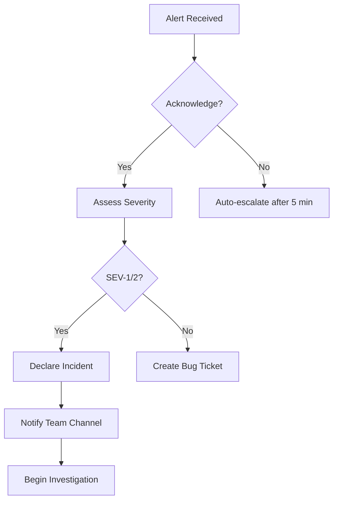

# StockFlow Enterprise — Incident Response Playbook

**Version:** 1.0  
**Last Updated:** 2026-07-26  
**Owner:** SRE Team  

---

## 1. Severity Levels

| Level | Label | Response Time | Example |
|-------|-------|---------------|---------|
| **SEV-1** | Critical | 5 min | Complete service outage, data loss, security breach |
| **SEV-2** | High | 15 min | Degraded performance, partial outage, feature broken |
| **SEV-3** | Medium | 1 hour | Non-critical bug, cosmetic issue, minor latency |
| **SEV-4** | Low | Next business day | Enhancement request, documentation fix |

---

## 2. Incident Response Process

### 2.1 Detection

Incidents are detected via:
- **Automated alerts**: Prometheus Alertmanager → PagerDuty
- **User reports**: Support tickets (SEV-3/4)
- **Manual observation**: Grafana dashboards
- **CI/CD pipeline failures**: GitHub Actions

### 2.2 Triage (First Responder)



**First responder checklist:**
- [ ] Acknowledge alert (within SLA)
- [ ] Check `/api/health` endpoints
- [ ] Review recent deployments
- [ ] Check error rate spike
- [ ] Review slow query logs
- [ ] Check PostgreSQL status
- [ ] Check Redis status

### 2.3 Mitigation

**Immediate actions:**
1. Stop the bleeding — rollback deployment if recent
2. Redirect traffic away from failing instance
3. Scale up if capacity issue
4. Restart service if hung
5. Block malicious IPs if security incident

**Then:**
1. Restore service to acceptable state
2. Monitor for 15 minutes to confirm stability
3. Apply temporary fix (if permanent fix takes longer)

### 2.4 Resolution

1. Implement permanent fix
2. Deploy via normal CI/CD pipeline
3. Verify monitoring returns to baseline
4. Close incident

### 2.5 Postmortem

**Required for SEV-1 and SEV-2 incidents.**

Postmortem must include:
- Timeline of events
- Root cause analysis
- Impact assessment
- Action items with owners
- Prevention measures

Postmortem must be completed within 5 business days.

---

## 3. Communication Templates

### 3.1 Incident Declaration

```
:rotating_light: INCIDENT DECLARED
Severity: SEV-[1/2]
Service: [Service Name]
Start Time: [Timestamp]
Summary: [Brief description]

Current Status: [Investigating/Mitigating/Resolved]
Impact: [What users/customers are affected]

Channel: #incident-[id]
Commander: @[name]
```

### 3.2 Status Update

```
:update: INCIDENT UPDATE #[number]
ID: [Incident ID]
Status: [Investigating/Identified/Mitigating/Resolved]

Progress:
1. [What was done]
2. [Current findings]
3. [Next steps]

ETA: [Estimated resolution time]
```

### 3.3 Resolution

```
:white_check_mark: INCIDENT RESOLVED
ID: [Incident ID]
Duration: [Total incident time]
Root Cause: [Brief description]
Fix: [What was done]

Postmortem scheduled: [Date]
```

---

## 4. Escalation Matrix

| Role | SEV-1 | SEV-2 | SEV-3 | SEV-4 |
|------|-------|-------|-------|-------|
| On-call Engineer | Immediate | Immediate | 15 min | 1 hour |
| SRE Team Lead | 15 min | 30 min | — | — |
| Engineering Manager | 15 min | 1 hour | — | — |
| CTO | 30 min | — | — | — |
| Security Officer | Immediate (security) | 1 hour (security) | — | — |

---

## 5. Incident Roles

| Role | Responsibility |
|------|----------------|
| **Incident Commander** | Coordinates response, makes decisions |
| **Scribe** | Documents timeline and actions |
| **Communications** | Updates stakeholders and status page |
| **Subject Matter Expert** | Technical investigation and fix |
| **Security Lead** | Investigation and containment (security incidents) |

---

## 6. Postmortem Template

```markdown
## Incident Postmortem

**Incident ID:** INC-YYYY-MM-DD-###
**Severity:** SEV-[1/2]
**Date:** YYYY-MM-DD
**Duration:** X hours Y minutes
**Commander:** @name

### Summary
[Brief description of incident]

### Impact
- Users affected: [count]
- Downtime duration: [time]
- Data loss: [yes/no]
- Financial impact: [$ amount]

### Timeline
| Time (UTC) | Event |
|------------|-------|
| 14:00 | Alert triggered |
| 14:05 | Engineer acknowledged |
| 14:10 | Root cause identified |
| 14:20 | Fix deployed |
| 14:25 | Service restored |

### Root Cause
[Detailed root cause analysis]

### Action Items
| # | Action | Owner | Due Date |
|---|--------|-------|----------|
| 1 | [Action] | @name | YYYY-MM-DD |

### Prevention
[What changes prevent recurrence]

### Lessons Learned
[What went well, what could be improved]
```

---

## 7. Security Incident Response

**Immediate steps for security incidents:**
1. Isolate affected systems (disconnect from network)
2. Preserve logs and evidence
3. Rotate all secrets and credentials
4. Notify Security Officer and CTO
5. Engage external forensics if needed
6. Notify affected customers (within legal requirements)
7. File incident report with relevant authorities (if required by law)

---

## 8. On-Call Schedule

- Primary: 1 week rotation (Mon–Mon)
- Secondary: Follows primary (shadow/backup)
- Escalation: SRE Team Lead → Engineering Manager → CTO

**Handoff process:**
1. Review open incidents and ongoing investigations
2. Verify monitoring dashboards
3. Confirm PagerDuty schedule
4. Document any ongoing issues
5. 15-minute overlap for knowledge transfer
